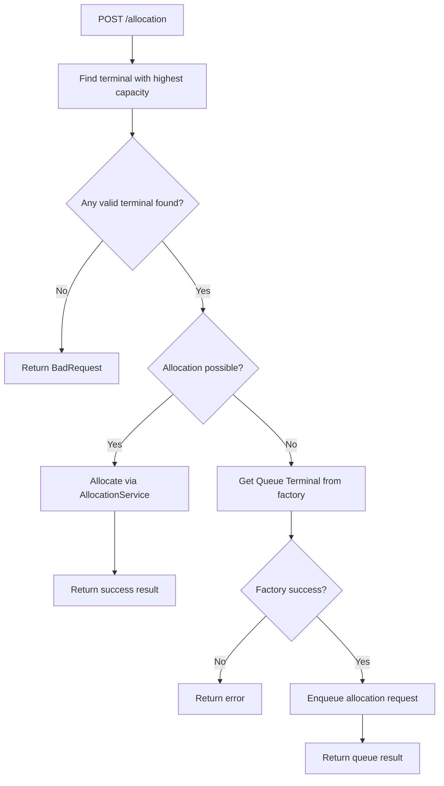
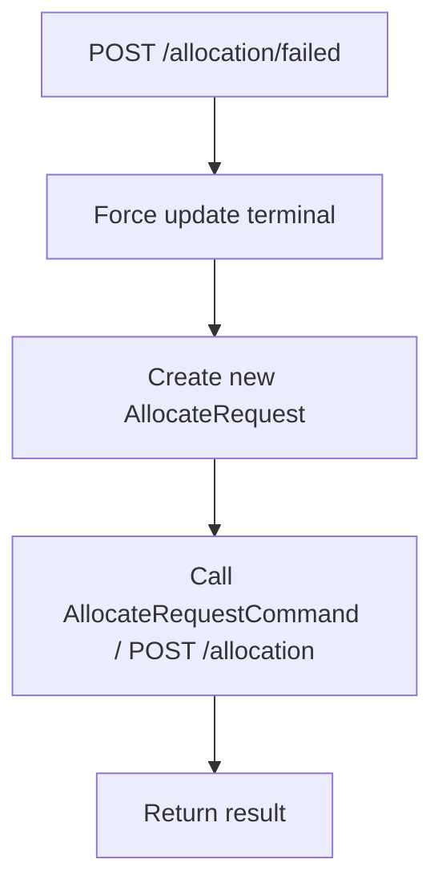
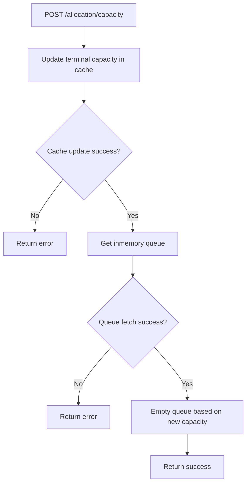

# Allocation Service API
API’et håndterer terminal‑allokering af pakker i det event‑drevne pakkesystem.
Servicen fungerer primært som en prioritetskø, der modtager allokeringsanmodninger, opdaterer kapacitet og publicerer resultater.

Se OpenApi Spec her: [OpenAPI spec](../AllocationService.Api/OpenApiScript/open-api-script.yaml)

#Endpoints
##POST /allocation
Processerer en ny terminal‑allokeringsanmodning og forsøger at allokere pakken baseret på prioritet og tilgængelige terminaler.
Bliver automatisk consumed af Event: allocate-parcel
##Request Body (JSON)
``` json
{
  "trackingNumber": "550e8400-e29b-41d4-a716-446655440000",
  "terminals": [
    "20000000-0000-0000-0000-000000000005",
    "30000000-0000-0000-0000-000000000001"
  ],
  "priority": 1
}
```
##Response (201 Created)
Ingen body returneres ved succes.

#POST /allocation/failed	
Modtager en mislykket allokeringsanmodning og forsøger at reallokere pakken.
Bliver automatisk consumed af Event: allocation-failed
##Request Body (JSON)
``` json
{
  "trackingNumber": "550e8400-e29b-41d4-a716-446655440000",
  "terminalId": "20000000-0000-0000-0000-000000000005"
}
```
##Response (201 Created)
Ingen body returneres ved succes.

#POST /allocation/capacity
Opdaterer terminalkapacitet i cachen og forsøger at allokere ventende pakker i køen.
Bliver automatisk consumed af Event: update-terminal-capacity
##Request Body (JSON)
``` json
{
  "terminalId": "20000000-0000-0000-0000-000000000005",
  "terminalCapacity": 150
}
```
##Response (202 Accepted)
Ingen body returneres ved succes.
##Response example (400 eller 500)
``` json
{
  "message": "Invalid request data"
}
```


# Flow diagram
## POST /allocation


## POST /allocation/failed


## POST /allocation/capacity
