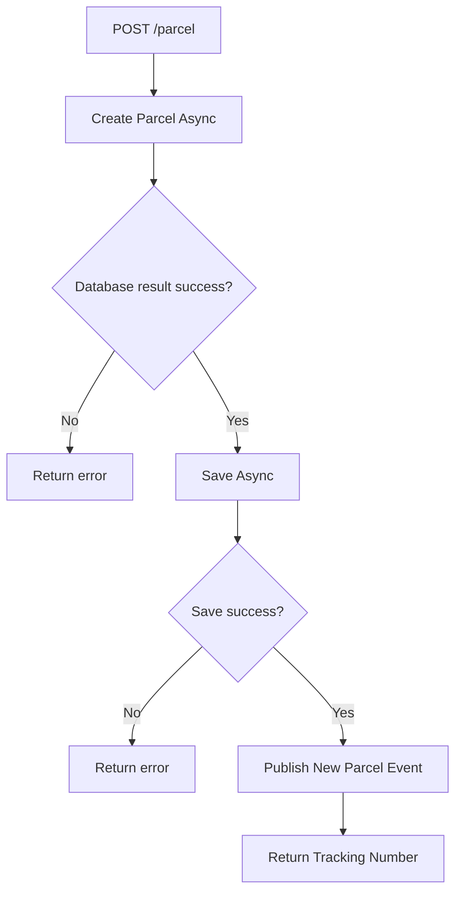

# Parcel Service API – Opret en ny forsendelse
POST /parcels opretter en ny pakke i det event‑drevne routingsystem. Ved succes genereres et trackingnummer, og der publiceres et ParcelCreated‑event på eventbussen.

Se OpenApi Spec her: [OpenAPI spec](ParcelService.Api/OpenApiScript/open-api-script.yaml)

## Request (JSON)
``` json
{
  "weight": 2.5,
  "priority": 1,
  "sender": {
    "terminal": {
      "id": "30000000-0000-0000-0000-000000000009"
    },
    "personalInformation": {
      "name": "John Doe",
      "address": {
        "street": "Main Street",
        "houseNumber": "12A",
        "city": "Aarhus",
        "zipCode": "8000",
        "country": "Denmark"
      }
    }
  },
  "receiver": {
    "terminal": {
      "id": "30000000-0000-0000-0000-000000000001"
    },
    "personalInformation": {
      "name": "Jane Smith",
      "address": {
        "street": "Baker Street",
        "houseNumber": "221B",
        "city": "Copenhagen",
        "zipCode": "2100",
        "country": "Denmark"
      }
    }
  }
}
```
## Response Example (201 Created)
``` json
{
  "trackingNumber": "550e8400-e29b-41d4-a716-446655440000"
}
```

## Failure reponses Example (400 or 500)
``` json
{
  "message": "Invalid request data"
}
```

# Flow diagram

