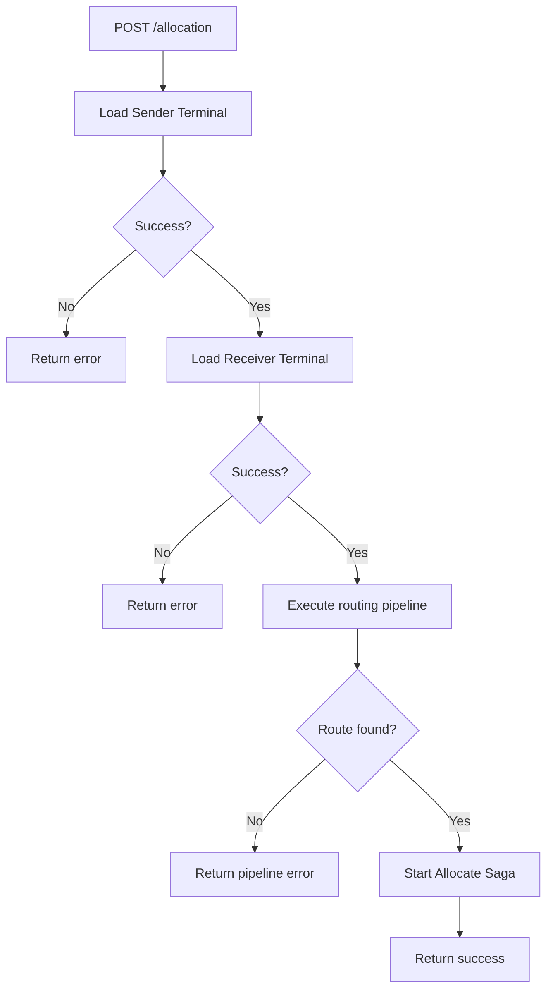
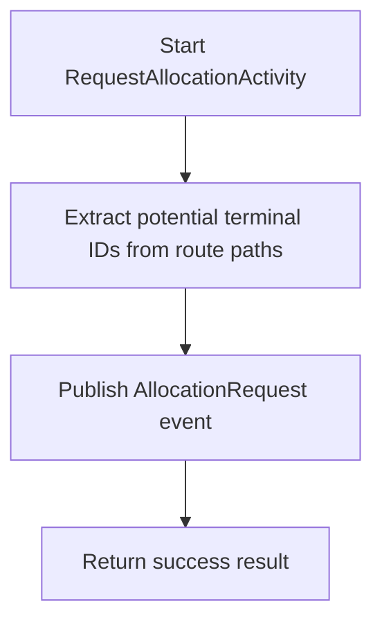

#Routing Service API
Routing Service håndterer routing af pakker i det event‑drevne pakkesystem.
Servicen konsumerer NewParcelEvent, beregner ruten mellem afsender‑ og modtagerterminaler og kan publicere et RoutingCreated‑event ved succes.

Derudover informerer servicen SAGA‑orchestration, når en allokering er modtaget.
Se OpenApi Spec her: [OpenAPI spec](../RoutingService.Api/OpenApiScript/open-api-script.yaml)

#Endpoints
##POST /routing/newparcelevent
Processerer et nyt parcel‑event og starter routinglogikken.
Bliver automatisk consumed af Event: new-parcel
###Request Body (JSON)
``` json
{
  "trackingNumber": "550e8400-e29b-41d4-a716-446655440000",
  "senderTerminal": "30000000-0000-0000-0000-000000000009",
  "receiverTerminal": "30000000-0000-0000-0000-000000000001",
  "priority": 1
}
```
###Response (202 Accepted)
Routing er modtaget og behandles asynkront.

##POST /routing/allocationreceivedevent
Informerer SAGA‑orchestration om, at en pakke er blevet allokeret.
###Request Body (JSON)
``` json
{
  "trackingNumber": "550e8400-e29b-41d4-a716-446655440000",
  "terminalId": "30000000-0000-0000-0000-000000000001"
}
```
###Response (200 OK)
Eventet er modtaget.
###Response example (400 eller 500)
``` json
{
  "message": "Invalid request data"
}
```

# Flow diagram
##POST /allocation


### Pipeline - Strategy selection


## POST /routing/allocationreceivedevent
```mermaid
flowchart TD
    A[RaiseSagaEvent] --> B[Send External Event to RoutingWorkflow]

    B --> C[Log event (trackingNumber + terminalId)]
    C --> D[Return]
```

## SAGA
```mermaid
flowchart TD
    A[Start RoutingWorkflow] --> B[Initialize route queue with root path]

    B --> C{Queue has routes?}

    C -- No --> Z[Complete workflow]

    C -- Yes --> D[Dequeue route path]

    D --> E[Call RequestAllocationActivity]

    E --> F[Wait for External Event (AllocationReceived)]

    F --> G{Terminal matches expected route?}

    G -- No --> F

    G -- Yes --> H[Select next route path]

    H --> I{Has next terminals?}

    I -- Yes --> B

    I -- No --> C

    Z --> Y[Return success result]
```
### RequestAllocationActivity
