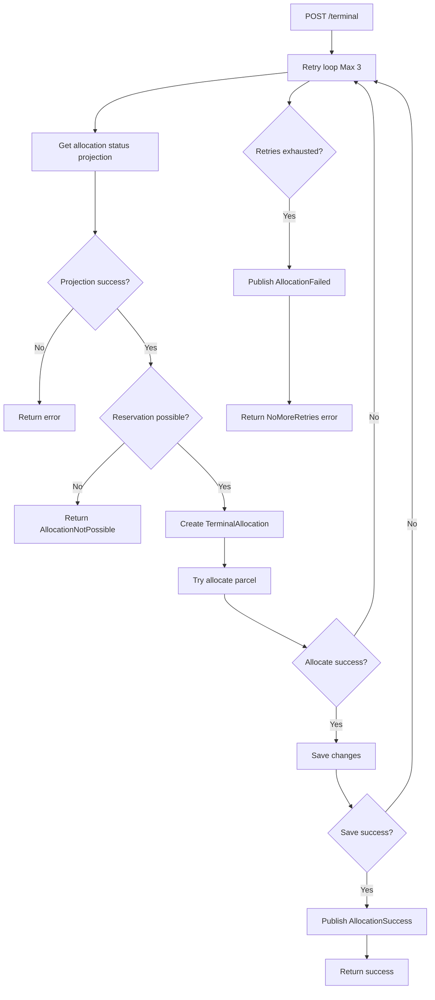
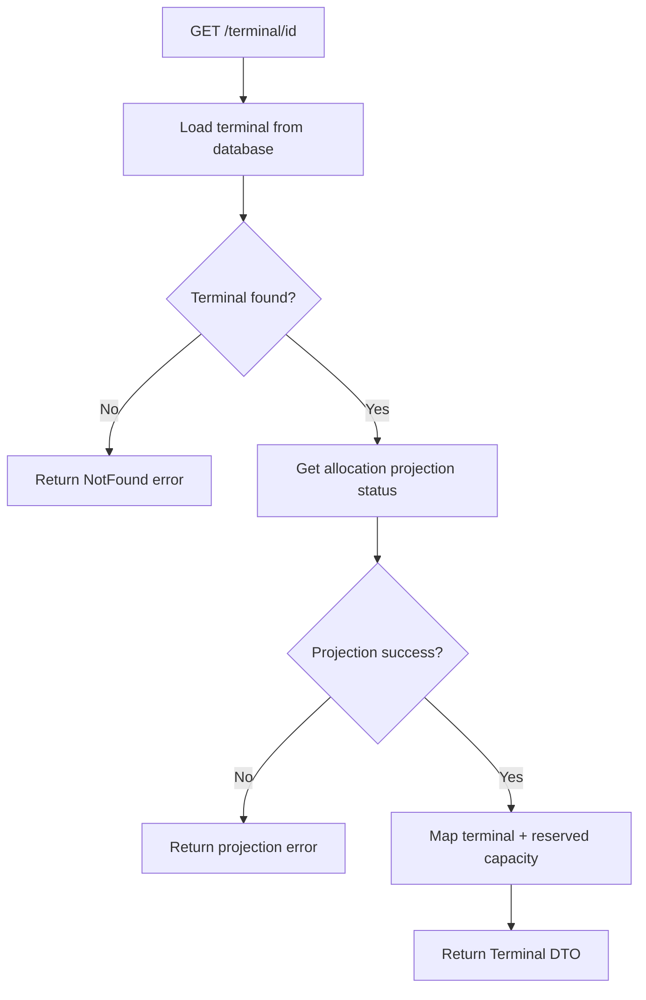

# Terminal Service API
Terminal Service håndterer terminalallokering af pakker samt generel metadata om terminaler i det event‑drevne pakkesystem.
Servicen modtager allokeringsanmodninger, opdaterer terminalstatus og eksponerer terminalopslag via ID.

Se OpenApi Spec her: [OpenAPI spec](TerminalService.Api/OpenApiScript/open-api-script.yaml)

# Endpoints
## POST /terminal
Processerer en ny terminal‑allokeringsanmodning og forsøger at allokere pakken til den angivne terminal.
### Request Body (JSON)
``` json
{
  "trackingNumber": "550e8400-e29b-41d4-a716-446655440000",
  "terminalId": "30000000-0000-0000-0000-000000000009"
}
```
### Response (201 Created)
Allokeringen er oprettet.

### Response failure example (400, 409 eller 500)
``` json
{
  "message": "Invalid request data"
}
```

## GET /terminal/{id}
Returnerer terminalmetadata for en given terminal‑ID.

### Response (200 Ok)
``` json
{
  "id": "30000000-0000-0000-0000-000000000009",
  "type": "DistributionCenter",
  "currentlyReserved": 20,
  "dailyCapacity": 120,
  "location": {
    "region": {
      "country": "Denmark",
      "mainRegion": "Jylland",
      "subRegion": "Horsens"
    },
    "address": {
      "city": {
        "name": "Horsens"
      },
      "street": "Havnevej",
      "streetNumber": 12
    }
  }
}
```

### Response failure example (404 eller 500)
``` json
{
  "message": "Terminal not found"
}
```

# Flow diagram
## POST /terminal


## GET /terminal/{id}

